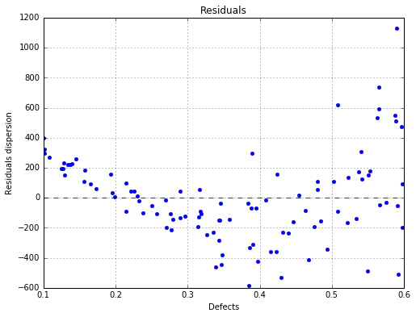
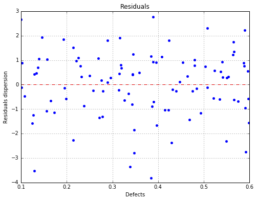

`ipynb source code <linearAnalysis.ipynb>`_

Linear model analysis
=====================

.. code:: python

    # import relevant module
    import openturns as ot
    import otpod
    # enable display figure in notebook
    %matplotlib inline

Generate data
-------------

.. code:: python

    N = 100
    ot.RandomGenerator.SetSeed(123456)
    defectDist = ot.Uniform(0.1, 0.6)
    # normal epsilon distribution
    epsilon = ot.Normal(0, 1.9)
    defects = defectDist.getSample(N)
    signalsInvBoxCox = defects * 43. + epsilon.getSample(N) + 2.5
    # Inverse Box Cox transformation
    invBoxCox = ot.InverseBoxCoxTransform(0.3)
    signals = invBoxCox(signalsInvBoxCox)

Run analysis without Box Cox
----------------------------

.. code:: python

    analysis = otpod.UnivariateLinearModelAnalysis(defects, signals)

Get some particular results
---------------------------

.. code:: python

    print analysis.getIntercept()
    print analysis.getR2()
    print analysis.getKolmogorovPValue()

.. parsed-literal::

    [Intercept for uncensored case : -604.758]
    [R2 for uncensored case : 0.780469]
    [Kolmogorov p-value for uncensored case : 0.803087]

Print all results of the linear regression and all tests on the residuals
-------------------------------------------------------------------------

A warning is printed because some residuals tests failed : the p-value
is less than 0.5.

.. code:: python

    analysis.printResults()

.. parsed-literal::

    WARNING:root:Some hypothesis tests failed : please consider to use the Box Cox transformation.

.. parsed-literal::

    --------------------------------------------------------------------------------
             Linear model analysis results
    --------------------------------------------------------------------------------
    Box Cox parameter :                             Not enabled              
                                                                             
                                                     Uncensored              
                                                                             
    Intercept coefficient :                             -604.76              
    Slope coefficient :                                 3606.04              
    Standard error of the estimate :                     291.47              
                                                                             
    Confidence interval on coefficients                                      
    Intercept coefficient :                       [-755.60, -453.91]              
    Slope coefficient :                           [3222.66, 3989.43]              
    Level :                                                0.95              
                                                                             
    Quality of regression                                                    
    R2 (> 0.8):                                            0.78              
    --------------------------------------------------------------------------------
    
    --------------------------------------------------------------------------------
             Residuals analysis results
    --------------------------------------------------------------------------------
    Fitted distribution (uncensored) :            Normal(mu = 5.95719e-13, sigma = 289.998)              
                                                                             
                                                     Uncensored              
    Distribution fitting test                                                
    Kolmogorov p-value (> 0.05):                            0.8              
                                                                             
    Normality test                                                           
    Anderson Darling p-value (> 0.05):                     0.07              
    Cramer Von Mises p-value (> 0.05):                     0.09              
                                                                             
    Zero residual mean test                                                  
    p-value (> 0.05):                                       1.0              
                                                                             
    Homoskedasticity test (constant variance)                                
    Breush Pagan p-value (> 0.05):                          0.0              
    Harrison McCabe p-value (> 0.05):                       0.2              
                                                                             
    Non autocorrelation test                                                 
    Durbin Watson p-value (> 0.05):                        0.99              
    --------------------------------------------------------------------------------
    

Show graphs
-----------

The linear model is not correct
~~~~~~~~~~~~~~~~~~~~~~~~~~~~~~~

.. code:: python

    fig, ax = analysis.drawLinearModel()
    fig.show()

.. image:: linearAnalysis_files/linearAnalysis_12_0.png

The residuals are not homoskedastic
~~~~~~~~~~~~~~~~~~~~~~~~~~~~~~~~~~~

.. code:: python

    fig, ax = analysis.drawResiduals()
    fig.show()

Run analysis with Box Cox
-------------------------

.. code:: python

    analysis = otpod.UnivariateLinearModelAnalysis(defects, signals, boxCox=True)

Print results of the linear regression and all tests on the residuals
---------------------------------------------------------------------

.. code:: python

    analysis.printResults()

.. parsed-literal::

    --------------------------------------------------------------------------------
             Linear model analysis results
    --------------------------------------------------------------------------------
    Box Cox parameter :                                    0.22              
                                                                             
                                                     Uncensored              
                                                                             
    Intercept coefficient :                                4.02              
    Slope coefficient :                                   25.55              
    Standard error of the estimate :                       1.34              
                                                                             
    Confidence interval on coefficients                                      
    Intercept coefficient :                        [3.33, 4.72]              
    Slope coefficient :                           [23.80, 27.31]              
    Level :                                                0.95              
                                                                             
    Quality of regression                                                    
    R2 (> 0.8):                                            0.89              
    --------------------------------------------------------------------------------
    
    --------------------------------------------------------------------------------
             Residuals analysis results
    --------------------------------------------------------------------------------
    Fitted distribution (uncensored) :            Normal(mu = 1.47438e-15, sigma = 1.32901)              
                                                                             
                                                     Uncensored              
    Distribution fitting test                                                
    Kolmogorov p-value (> 0.05):                           0.34              
                                                                             
    Normality test                                                           
    Anderson Darling p-value (> 0.05):                     0.06              
    Cramer Von Mises p-value (> 0.05):                     0.07              
                                                                             
    Zero residual mean test                                                  
    p-value (> 0.05):                                       1.0              
                                                                             
    Homoskedasticity test (constant variance)                                
    Breush Pagan p-value (> 0.05):                         0.65              
    Harrison McCabe p-value (> 0.05):                      0.51              
                                                                             
    Non autocorrelation test                                                 
    Durbin Watson p-value (> 0.05):                        0.97              
    --------------------------------------------------------------------------------
    

Save all results in a csv file
------------------------------

.. code:: python

    analysis.saveResults('results.csv')

Show graphs
-----------

The linear regression model with data
~~~~~~~~~~~~~~~~~~~~~~~~~~~~~~~~~~~~~

.. code:: python

    fig, ax = analysis.drawLinearModel(name='figure/linearModel.png')
    # The figure is saved as png file
    fig.show()

.. image:: linearAnalysis_files/linearAnalysis_22_0.png

The residuals with respect to the defects
~~~~~~~~~~~~~~~~~~~~~~~~~~~~~~~~~~~~~~~~~

.. code:: python

    fig, ax = analysis.drawResiduals(name='figure/residuals.eps')
    # The figure is saved as eps file
    fig.show()

The fitted residuals distribution with the histogram
~~~~~~~~~~~~~~~~~~~~~~~~~~~~~~~~~~~~~~~~~~~~~~~~~~~~

.. code:: python

    fig, ax = analysis.drawResidualsDistribution()
    ax.set_ylim(ymax=0.45)
    fig.show()
    # The figure is saved after the changes
    fig.savefig('figure/residualsDistribution.png', bbox_inches='tight')

.. image:: linearAnalysis_files/linearAnalysis_26_0.png

The residuals QQ plot
~~~~~~~~~~~~~~~~~~~~~

.. code:: python

    fig, ax = analysis.drawResidualsQQplot()
    fig.show()

.. image:: linearAnalysis_files/linearAnalysis_28_0.png

The Box Cox likelihood with respect to the defect
~~~~~~~~~~~~~~~~~~~~~~~~~~~~~~~~~~~~~~~~~~~~~~~~~

.. code:: python

    fig, ax = analysis.drawBoxCoxLikelihood(name='figure/BoxCoxlikelihood.png')
    fig.show()

.. image:: linearAnalysis_files/linearAnalysis_30_0.png

