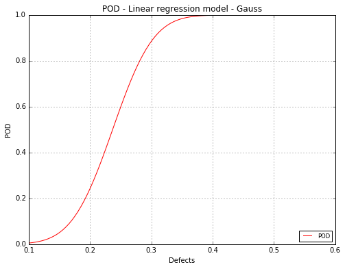
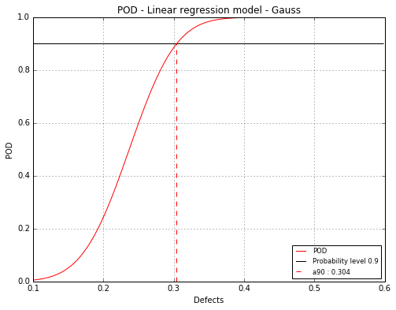

Linear model POD
================

.. code:: python

    # import relevant module
    import openturns as ot
    import otpod
    # enable display figure in notebook
    %matplotlib inline

Generate data
-------------

.. code:: python

    N = 100
    ot.RandomGenerator.SetSeed(123456)
    defectDist = ot.Uniform(0.1, 0.6)
    # normal epsilon distribution
    epsilon = ot.Normal(0, 1.9)
    defects = defectDist.getSample(N)
    signalsInvBoxCox = defects * 43. + epsilon.getSample(N) + 2.5
    # Inverse Box Cox transformation
    invBoxCox = ot.InverseBoxCoxTransform(0.3)
    signals = invBoxCox(signalsInvBoxCox)

Build POD using previous linear analysis
----------------------------------------

.. code:: python

    # run the analysis with Gaussian hypothesis of the residuals (default case)
    analysis = otpod.UnivariateLinearModelAnalysis(defects, signals, boxCox=True)

.. code:: python

    # signal detection threshold
    detection = 200.
    # Use the analysis to build the POD with Gaussian hypothesis
    POD = otpod.UnivariateLinearModelPOD(analysis=analysis, detection=detection)
    POD.run()

Compute detection size
----------------------

.. code:: python

    # Detection size at probability level 0.9
    # and confidence level 0.95
    print POD.computeDetectionSize(0.9, 0.95)
    
    # with confidence level 0.99
    print POD.computeDetectionSize(0.9, 0.99)

.. parsed-literal::

    [a90 : 0.303982, a90/95 : 0.316184]
    [a90 : 0.303982, a90/99 : 0.322652]

get POD NumericalMathFunction
-----------------------------

.. code:: python

    # get the POD model
    PODmodel = POD.getPODModel()
    # get the POD model at the given confidence level
    PODmodelCl95 = POD.getPODCLModel(0.95)
    
    # compute the probability of detection for a given defect value
    print 'POD : {:0.3f}'.format(PODmodel([0.3])[0])
    print 'POD at level 0.95 : {:0.3f}'.format(PODmodelCl95([0.3])[0])

.. parsed-literal::

    POD : 0.886
    POD at level 0.95 : 0.841

Show POD graphs
---------------

Only the mean POD
~~~~~~~~~~~~~~~~~

.. code:: python

    fig, ax = POD.drawPOD()
    fig.show()

Mean POD with the detection size for a given probability level
~~~~~~~~~~~~~~~~~~~~~~~~~~~~~~~~~~~~~~~~~~~~~~~~~~~~~~~~~~~~~~

.. code:: python

    fig, ax = POD.drawPOD(probabilityLevel=0.9)
    fig.show()

Mean POD with POD at confidence level
~~~~~~~~~~~~~~~~~~~~~~~~~~~~~~~~~~~~~

.. code:: python

    fig, ax = POD.drawPOD(confidenceLevel=0.95)
    fig.show()

.. image:: linearPODfromAnalysis_files/linearPODfromAnalysis_16_0.png

Mean POD and POD at confidence with the detection size for a given probability level
~~~~~~~~~~~~~~~~~~~~~~~~~~~~~~~~~~~~~~~~~~~~~~~~~~~~~~~~~~~~~~~~~~~~~~~~~~~~~~~~~~~~

