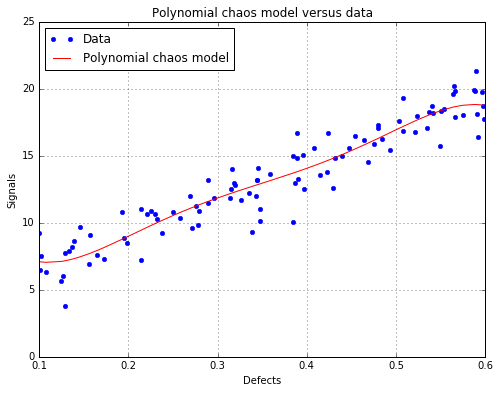
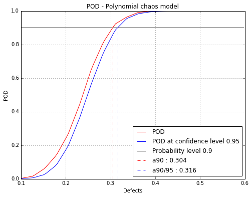

`ipynb source code <polynomialChaosPOD.ipynb>`_

Polynomial chaos POD
====================

.. code:: python

    # import relevant module
    import openturns as ot
    import otpod
    # enable display figure in notebook
    %matplotlib inline
    from time import time

Generate 1D data
----------------

.. code:: python

    N = 100
    ot.RandomGenerator.SetSeed(123456)
    defectDist = ot.Uniform(0.1, 0.6)
    # normal epsilon distribution
    epsilon = ot.Normal(0, 1.9)
    defects = defectDist.getSample(N)
    signalsInvBoxCox = defects * 43. + epsilon.getSample(N) + 2.5
    # Inverse Box Cox transformation
    invBoxCox = ot.InverseBoxCoxTransform(0.3)
    signals = invBoxCox(signalsInvBoxCox)

Build POD with polynomial chaos model
-------------------------------------

.. code:: python

    # signal detection threshold
    detection = 200.
    # The POD with censored data actually builds a POD only on filtered data.
    # A warning is diplayed in this case.
    POD = otpod.PolynomialChaosPOD(defects, signals, detection,
                                   noiseThres=200., saturationThres=1700.,
                                   boxCox=True)

.. parsed-literal::

    INFO:root:Censored data are not taken into account : the polynomial chaos model is only built on filtered data.

User-defined defect sizes
~~~~~~~~~~~~~~~~~~~~~~~~~

The user-defined defect sizes must range between the minimum and maximum
of the defect values after filtering. An error is raised if if not the
case. The available range is then returned to the user.

.. code:: python

    # Default defect sizes
    print 'Default defect sizes : '
    print POD.getDefectSizes()
    
    # Wrong range
    POD.setDefectSizes([0.12, 0.3, 0.5, 0.57])

.. parsed-literal::

    Default defect sizes : 
    [ 0.19288542  0.21420345  0.23552149  0.25683952  0.27815756  0.29947559
      0.32079363  0.34211166  0.3634297   0.38474773  0.40606577  0.4273838
      0.44870184  0.47001987  0.49133791  0.51265594  0.53397398  0.55529201
      0.57661005  0.59792808]

::

    ---------------------------------------------------------------------------

    ValueError                                Traceback (most recent call last)

    <ipython-input-4-ccee3ce344ea> in <module>()
          4 
          5 # Wrong range
    ----> 6 POD.setDefectSizes([0.12, 0.3, 0.5, 0.57])
    

    /home/dumas/projet/ByPASS_pmpr635/otpod/otpod/_polynomial_chaos_pod.py in setDefectSizes(self, size)
        368             raise ValueError('Defect sizes must range between ' + \
        369                              '{:0.4f} '.format(np.ceil(minMin*10000)/10000) + \
    --> 370                              'and {:0.4f}.'.format(np.floor(maxMax*10000)/10000))
        371         self._defectNumber = self._defectSizes.shape[0]
        372 

    ValueError: Defect sizes must range between 0.1929 and 0.5979.

.. code:: python

    # Good range
    POD.setDefectSizes([0.1929, 0.3, 0.4, 0.5, 0.5979])
    print 'User-defined defect size : '
    print POD.getDefectSizes()

.. parsed-literal::

    User-defined defect size : 
    [ 0.1929  0.3     0.4     0.5     0.5979]

Running the polynomial chaos based POD
~~~~~~~~~~~~~~~~~~~~~~~~~~~~~~~~~~~~~~

The computing time can be reduced by setting the simulation size
attribute to another value. However the confidence interval is less
accurate.

The sampling size is the number of the samples used to compute the POD
with the Monte Carlo simulation for each defect sizes.

.. code:: python

    # Computing the confidence interval in the run takes few minutes.
    t0 = time()
    POD = otpod.PolynomialChaosPOD(defects, signals, detection,
                                      boxCox=True)
    # we can change the sample size of the Monte Carlo simulation
    POD.setSamplingSize(5000) # default is 10000
    # we can also change the size of the simulation to compute the confidence interval
    POD.setSimulationSize(500) # default is 1000
    POD.run()
    print 'Computing time : {:0.2f} s'.format(time()-t0) 

.. parsed-literal::

    Computing time : 124.58 s

Compute detection size
----------------------

.. code:: python

    # Detection size at probability level 0.9
    # and confidence level 0.95
    print POD.computeDetectionSize(0.9, 0.95)
    
    # probability level 0.95 with confidence level 0.99
    print POD.computeDetectionSize(0.95, 0.99)

.. parsed-literal::

    [a90 : 0.299768, a90/95 : 0.309587]
    [a95 : 0.322198, a95/99 : 0.334486]

get POD NumericalMathFunction
-----------------------------

.. code:: python

    # get the POD model
    PODmodel = POD.getPODModel()
    # get the POD model at the given confidence level
    PODmodelCl95 = POD.getPODCLModel(0.95)
    
    # compute the probability of detection for a given defect value
    print 'POD : {:0.3f}'.format(PODmodel([0.3])[0])
    print 'POD at level 0.95 : {:0.3f}'.format(PODmodelCl95([0.3])[0])

.. parsed-literal::

    POD : 0.901
    POD at level 0.95 : 0.858

Compute the R2 and the Q2
-------------------------

Enable to check the quality of the model.

.. code:: python

    print 'R2 : {:0.4f}'.format(POD.getR2())
    print 'Q2 : {:0.4f}'.format(POD.getQ2())

.. parsed-literal::

    R2 : 0.8975
    Q2 : 0.8922

Show POD graphs
---------------

Mean POD and POD at confidence level with the detection size for a given probability level
~~~~~~~~~~~~~~~~~~~~~~~~~~~~~~~~~~~~~~~~~~~~~~~~~~~~~~~~~~~~~~~~~~~~~~~~~~~~~~~~~~~~~~~~~~

.. code:: python

    fig, ax = POD.drawPOD(probabilityLevel=0.9, confidenceLevel=0.95,
                          name='figure/PODPolyChaos.png')
    # The figure is saved in PODPolyChaos.png
    fig.show()

.. parsed-literal::

    /home/dumas/anaconda2/lib/python2.7/site-packages/matplotlib/figure.py:397: UserWarning: matplotlib is currently using a non-GUI backend, so cannot show the figure
      "matplotlib is currently using a non-GUI backend, "

Show the polynomial chaos model (only available if the input dimension is 1)
~~~~~~~~~~~~~~~~~~~~~~~~~~~~~~~~~~~~~~~~~~~~~~~~~~~~~~~~~~~~~~~~~~~~~~~~~~~~

.. code:: python

    fig, ax = POD.drawPolynomialChaosModel()
    fig.show()

Advanced user mode
------------------

The user can defined one or all parameters of the polynomial chaos
algorithm : - the distribution of the input parameters - the adaptive
strategy - the projection strategy

.. code:: python

    # new POD study
    POD = otpod.PolynomialChaosPOD(defects, signals, detection,
                                   boxCox=True)

.. code:: python

    # define the input parameter distribution
    distribution = ot.ComposedDistribution([ot.Normal(0.3, 0.1)])
    POD.setDistribution(distribution)

.. code:: python

    # define the adaptive strategy
    polyCol = [ot.HermiteFactory()]
    enumerateFunction = ot.EnumerateFunction(1)
    multivariateBasis = ot.OrthogonalProductPolynomialFactory(polyCol, enumerateFunction)
    # degree 1
    p = 1
    indexMax = enumerateFunction.getStrataCumulatedCardinal(p)
    adaptiveStrategy = ot.FixedStrategy(multivariateBasis, indexMax)
    
    POD.setAdaptiveStrategy(adaptiveStrategy)

.. code:: python

    # define the projection strategy
    projectionStrategy = ot.LeastSquaresStrategy()
    POD.setProjectionStrategy(projectionStrategy)

.. code:: python

    POD.run()

.. code:: python

    print POD.computeDetectionSize(0.9, 0.95)
    print 'R2 : {:0.4f}'.format(POD.getR2())
    print 'Q2 : {:0.4f}'.format(POD.getQ2())

.. parsed-literal::

    [a90 : 0.30596, a90/95 : 0.316326]
    R2 : 0.8947
    Q2 : 0.8914

.. code:: python

    fig, ax = POD.drawPOD(probabilityLevel=0.9, confidenceLevel=0.95)
    fig.show()

.. code:: python

    fig, ax = POD.drawPolynomialChaosModel()
    fig.show()

