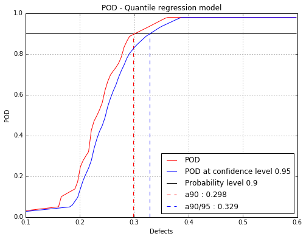
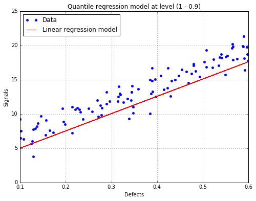

`ipynb source code <quantileRegressionPOD.ipynb>`_

Qantile Regression POD
======================

.. code:: python

    # import relevant module
    import openturns as ot
    import otpod
    # enable display figure in notebook
    %matplotlib inline
    from time import time

Generate data
-------------

.. code:: python

    N = 100
    ot.RandomGenerator.SetSeed(123456)
    defectDist = ot.Uniform(0.1, 0.6)
    # normal epsilon distribution
    epsilon = ot.Normal(0, 1.9)
    defects = defectDist.getSample(N)
    signalsInvBoxCox = defects * 43. + epsilon.getSample(N) + 2.5
    # Inverse Box Cox transformation
    invBoxCox = ot.InverseBoxCoxTransform(0.3)
    signals = invBoxCox(signalsInvBoxCox)

Build POD with quantile regression technique
--------------------------------------------

.. code:: python

    # signal detection threshold
    detection = 200.
    # The POD with censored data actually builds a POD only on filtered data.
    # A warning is diplayed in this case.
    POD = otpod.QuantileRegressionPOD(defects, signals, detection,
                                      noiseThres=60., saturationThres=1700.,
                                      boxCox=True)

.. parsed-literal::

    INFO:root:Censored data are not taken into account : the quantile regression model is only performed on filtered data.

Quantile user-defined
~~~~~~~~~~~~~~~~~~~~~

.. code:: python

    # Default quantile values
    print 'Default quantile : '
    print POD.getQuantile()
    # Defining user quantile, they must range between 0 and 1.
    POD.setQuantile([0.1, 0.3, 0.5, 0.7, 0.8, 0.85, 0.9, 0.95])
    print 'User-defined quantile : '
    print POD.getQuantile()

.. parsed-literal::

    Default quantile : 
    [ 0.05    0.0965  0.143   0.1895  0.236   0.2825  0.329   0.3755  0.422
      0.4685  0.515   0.5615  0.608   0.6545  0.701   0.7475  0.794   0.8405
      0.887   0.9335  0.98  ]
    User-defined quantile : 
    [ 0.1   0.3   0.5   0.7   0.8   0.85  0.9   0.95]

Running quantile regression POD
~~~~~~~~~~~~~~~~~~~~~~~~~~~~~~~

.. code:: python

    # Due to the bootstrap technique used to compute the confidence
    # interval, the run take few minutes.
    t0 = time()
    POD = otpod.QuantileRegressionPOD(defects, signals, detection,
                                      boxCox=True)
    POD.run()
    print 'Computing time : {:0.2f} s'.format(time()-t0) 

.. parsed-literal::

    Computing time : 151.68 s

The computing time can be reduced by setting the simulation size
attribute to another value. However the confidence interval is less
accurate.

The number of quantile values can also be reduced to save time.

.. code:: python

    t0 = time()
    PODsimulSize100 = otpod.QuantileRegressionPOD(defects, signals, detection,
                                      boxCox=True)
    PODsimulSize100.setSimulationSize(100) # default is 1000
    PODsimulSize100.run()
    print 'Computing time : {:0.2f} s'.format(time()-t0) 

.. parsed-literal::

    Computing time : 15.95 s

Compute detection size
----------------------

.. code:: python

    # Detection size at probability level 0.9
    # and confidence level 0.95
    print POD.computeDetectionSize(0.9, 0.95)
    
    # probability level 0.95 with confidence level 0.99
    print POD.computeDetectionSize(0.95, 0.99)

.. parsed-literal::

    [a90 : 0.298115, a90/95 : 0.328774]
    [a95 : 0.331931, a95/99 : 0.372112]

get POD NumericalMathFunction
-----------------------------

.. code:: python

    # get the POD model
    PODmodel = POD.getPODModel()
    # get the POD model at the given confidence level
    PODmodelCl95 = POD.getPODCLModel(0.95)
    
    # compute the probability of detection for a given defect value
    print 'POD : {:0.3f}'.format(PODmodel([0.3])[0])
    print 'POD at level 0.95 : {:0.3f}'.format(PODmodelCl95([0.3])[0])

.. parsed-literal::

    POD : 0.899
    POD at level 0.95 : 0.832

Compute the pseudo R2 for a given quantile
------------------------------------------

.. code:: python

    print 'Pseudo R2 for quantile 0.9 : {:0.3f}'.format(POD.getR2(0.9))
    print 'Pseudo R2 for quantile 0.95 : {:0.3f}'.format(POD.getR2(0.95))

.. parsed-literal::

    Pseudo R2 for quantile 0.9 : 0.675
    Pseudo R2 for quantile 0.95 : 0.656

Show POD graphs
---------------

Mean POD and POD at confidence level with the detection size for a given probability level
~~~~~~~~~~~~~~~~~~~~~~~~~~~~~~~~~~~~~~~~~~~~~~~~~~~~~~~~~~~~~~~~~~~~~~~~~~~~~~~~~~~~~~~~~~

.. code:: python

    fig, ax = POD.drawPOD(probabilityLevel=0.9, confidenceLevel=0.95,
                          name='figure/PODQuantReg.png')
    # The figure is saved in PODQuantReg.png
    fig.show()

Show the linear regression model at the given quantile
~~~~~~~~~~~~~~~~~~~~~~~~~~~~~~~~~~~~~~~~~~~~~~~~~~~~~~

.. code:: python

    fig, ax = POD.drawLinearModel(0.9)
    fig.show()

